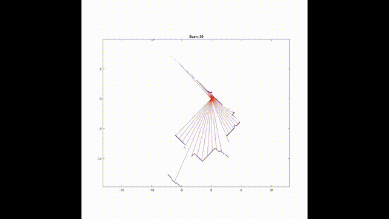

# Theory-and-Technology-of-Robotics-Course-Project-Spring-2022
This is a repository of course materials of Theory and Technology of Robotics (Spring 2022)  
You can download the dataset at [here](https://google-cartographer-ros.readthedocs.io/en/latest/data.html)  
This project was adapted from [meyiao. "LaserSLAM"](https://github.com/meyiao/LaserSLAM)  
We did a research on this topic and fixed some problem in the original code.  
Here is the demo  
